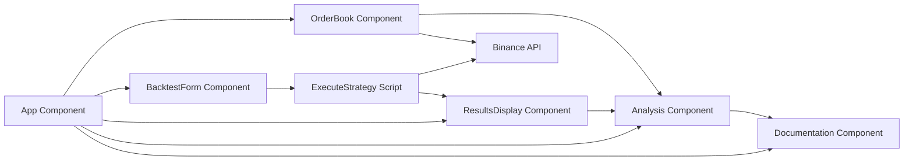

This project aims to assist researchers in backtesting their custom trading strategies with cryptocurrency data derived from Binance.

## Getting Started

Follow these instructions to set up and run the project locally.

### Prerequisites

Ensure you have the following installed on your local development machine:

- **Git**: Version control system to clone the repository.
- **Node.js**: JavaScript runtime to run the project.
- **npm**: Node package manager to install dependencies.

### Installation

1. **Clone the Repository**

   Clone the repository to your local machine using the following command:

   ```sh
   git clone https://github.com/JunHao247/Backtesting-Platform.git

2. **Navigate to the project directory**
   
   ```sh
   cd Backtesting-Platform

3. **Install Dependencies**
   ```sh
   npm install
   pip install pandas
   pip install joblib


4. **Start the static server**

    From the terminal, in the project directory, you can run the below to start the server:   
    ```sh
    node server.js

5. **Start the application**

   a. From the terminal, in the project directory, you can run the below to start the application:   
    ```sh
    npm start
      ```
   b. Alternatively, you may go to https://junhao247.github.io/Backtesting-Platform/ to utilise the production build application.


By following the above steps, the application should be running locally.


## Troubleshooting

### macOS Security Warning for fsevents.node

If you encounter a security warning about `fsevents.node` when running the application on macOS, you can resolve it by running the following commands in your terminal:

1. **Navigate to your project directory**:

    ```bash
    cd /path/to/your/project
    ```

2. **Remove `node_modules` and reinstall packages**:

    ```bash
    rm -rf node_modules
    npm install
    ```


Alternatively, you can clone the repository directly from GitHub to avoid this issue:

```bash
git clone https://github.com/your-username/your-repository-name.git
```

System Architecture Diagram

